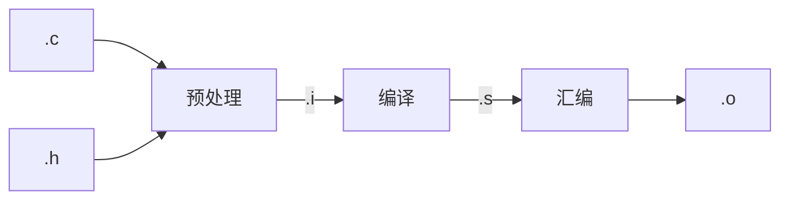

# gcc及其编译过程简述
对于gcc而言
gcc常用选项：
  -o &lt;file&gt;                Place the output into &lt;file&gt; 
                           
  -E                       Preprocess only; do not compile, assemble or link

  -S                       Compile only; do not assemble or link

  -c                       Compile and assemble, but do not link 
\
其过程可以表示为：


# 1.1 预编译
1.处理所有注释，用空格代替注释
2.将所有#define删除，并展开所有宏定义
3.处理条件编译
4.处理#include，展开被包含的文件（*可用#pragma将预处理进行忽略*）
示例：
```gcc
gcc -E file.c -O file.i
```
# 1.2 编译
对.i文件进行**词法分析**、**语法分析**、**语义分析**
```gcc
gcc -S file.i -O file.s
```
# 1.3 汇编
将.S的汇编代码转化为机器指令
```gcc
gcc -C file.s -O file.o
```
# 1.4 链接
<!--用makefie把示例写一下-->
## 1.4.1 静态链接
静态链接使用静态库进行链接，生成的程序包含程序运行所需要的全部库，可以直接运行，
不过静态链接生成的程序体积较大。
1.编译静态库源码：`gcc -C lib.c -O lib.o`
2.生成静态库文件：`gcc -q lib.a -O lib.o`
3.使用静态库编译：`gcc -C lib.c -O lib.o`

## 1.4.2 动态链接
动态链接使用动态链接库进行链接，生成的程序在执行的时候需要加载所需的动态库才能运行。
动态链接生成的程序体积较小，但是必须依赖所需的动态库，否则无法执行。但是方便程序升级
